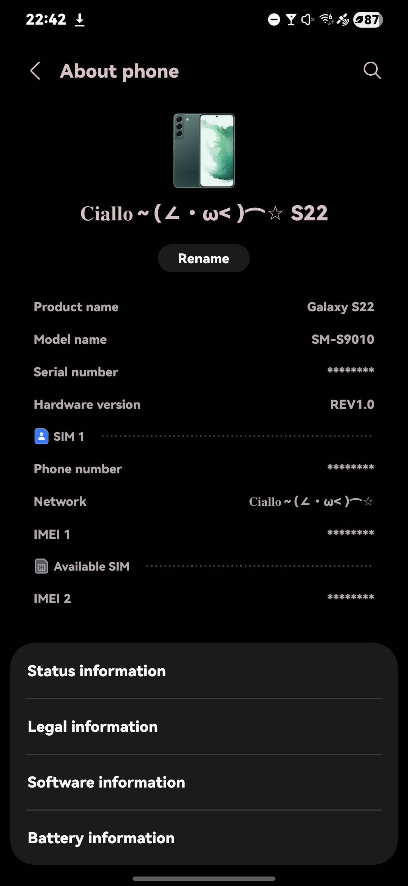
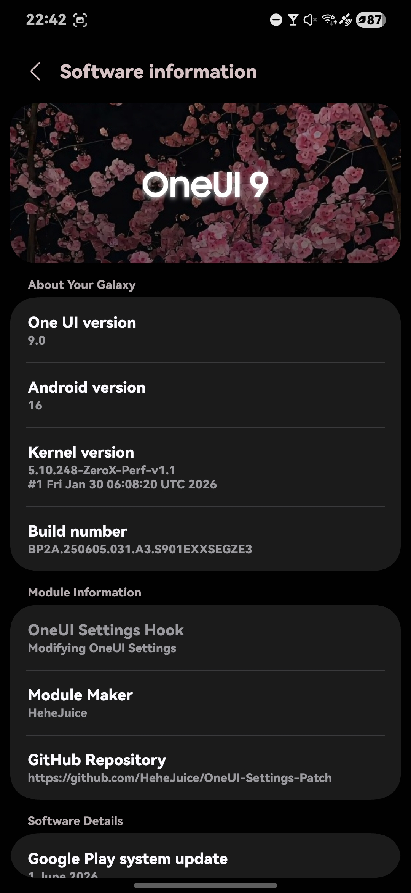
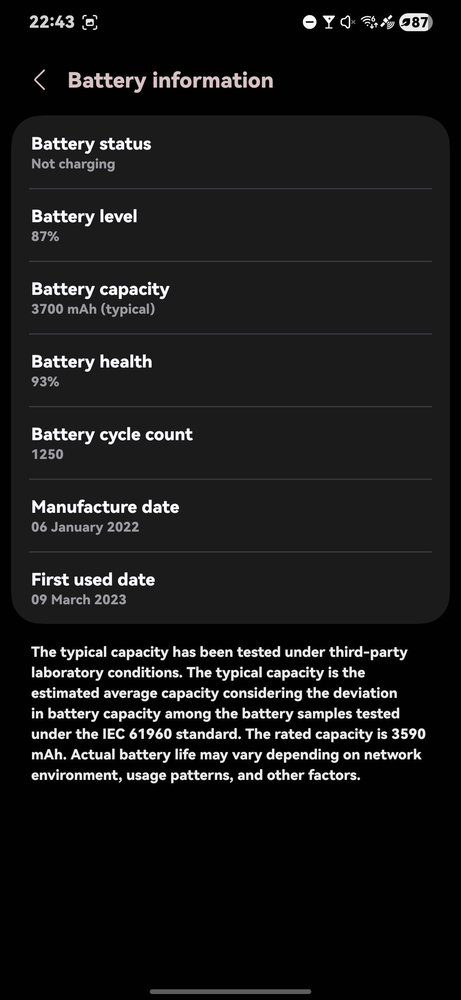
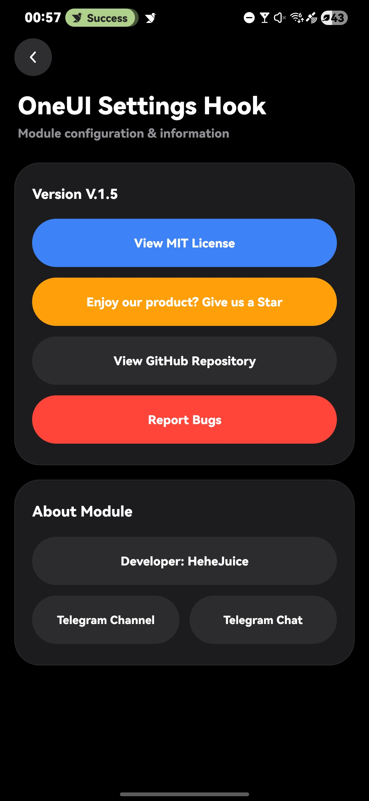
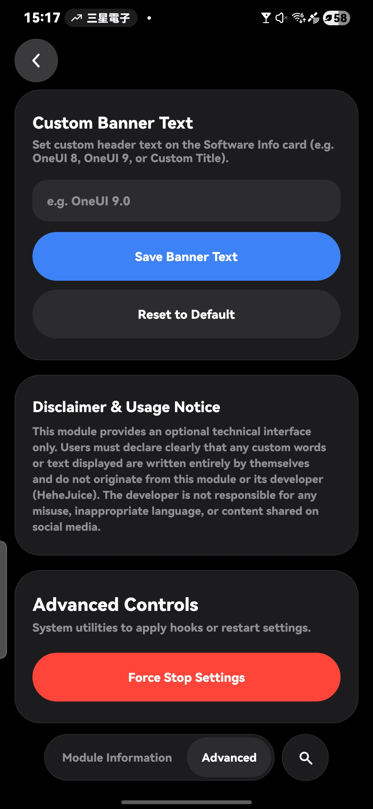
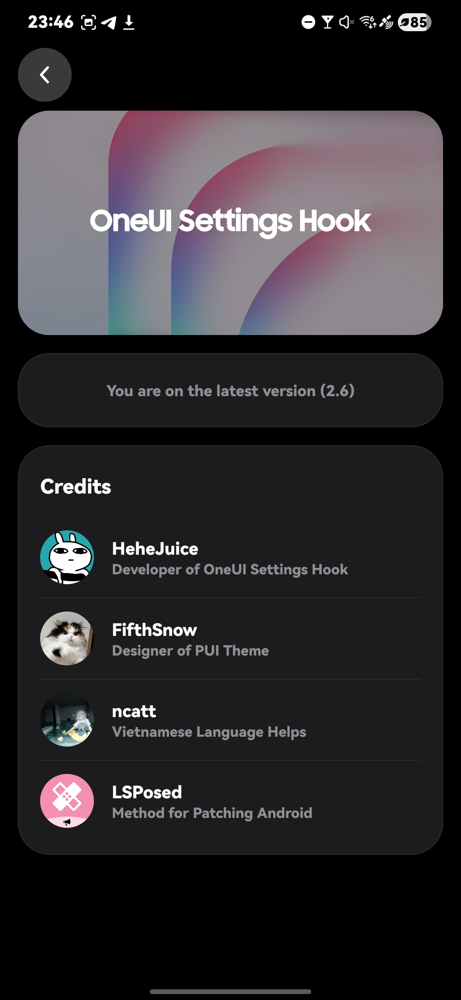

<h1 align="center">
  
</h1>

### 🗺 Tổng quan dự án
- OneUI-Settings-Hook 
- Áp dụng bản vá (patch) cho ứng dụng Cài đặt từ OneUI 7 trở lên
     - Đã thử nghiệm trên OneUI 7 ~ 9
- Yêu cầu thiết bị đã Root và cài đặt LSPosed

### 😶‍🌫️ Tính năng
- ‼️ Thiết kế lại trang Thông tin phần mềm
     - Hiệu ứng chữ phát sáng 
     - Tùy chỉnh văn bản trong Cài đặt Nâng cao của Module 
          - Bạn nên đọc kỹ phần "Tuyên bố từ chối trách nhiệm & Lưu ý sử dụng" trong Cài đặt Nâng cao của Module trước khi sử dụng 
     - Hình nền thẻ Thông tin phần mềm = Hình nền màn hình chính
- Biểu tượng trang chủ có thể tùy chỉnh 
     - OneUI Monet
     - OneUI 6 Monet
     - PUI Theme
- Tên sản phẩm có thể tùy chỉnh
- Bảo vệ thông tin nhạy cảm 
     - Tự động ẩn các thông tin sau:
          - IMEI
          - Số Sê-ri (Series Number)
          - Số điện thoại 
- Xóa bỏ cơ chế phát hiện phông chữ tùy chỉnh
     - Hỗ trợ các file APK phông chữ tùy chỉnh
- Có khả năng sao chép tất cả các ứng dụng
- Mở khóa thêm Thông tin chi tiết về Pin
- Cài đặt Module LSPosed

### 📂 Xem trước

### ℹ️ Hướng dẫn sử dụng
- Cài đặt file .APK và kích hoạt trong LSPosed
- Cấp quyền Root cho ứng dụng 
- Buộc dừng (Force-Stop) ứng dụng Cài đặt(LSPosed TRONG)
- Mở lại ứng dụng Cài đặt
- Thay đổi chưa được áp dụng? Hãy mở một "issue" (báo lỗi trên GitHub) kèm theo Chi tiết phần mềm thiết bị của bạn

### 🥰 Lời cảm ơn
- Bạn có thể xem nó trong ứng dụng sau khi cài đặt.
